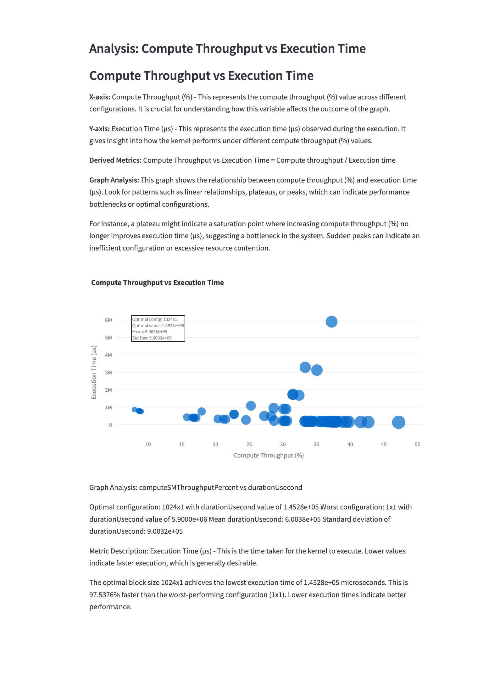

# README for Convolution Project

## Section 1: Overview and Introduction

This project implements a 2D convolution operation using both CPU and GPU (CUDA) for performance comparison and profiling. It also includes tools for profiling the performance of the kernels using the X86 Profiler and visualizing results with a Streamlit application.

### Key Features:
- **CPU and GPU Convolution Implementations**: Provides both CPU and GPU (CUDA) implementations for 2D convolution.
- **OpenMP Support**: The CPU implementation can be parallelized using OpenMP.
- **Performance Profiling**: Uses a Python-based X86 Profiler to gather detailed performance metrics for the CUDA kernels.
- **Visualization**: Streamlit app to visualize the performance metrics in an interactive dashboard.

### Inputs and Outputs:

- **Input Tensor**: [Batch, Channels, Height, Width]
- **Filter Tensor**: [Out Channels, In Channels, Filter Height, Filter Width]
- **Output Tensor**: [Batch, Out Channels, Output Height, Output Width]

**Initialization Types:**
- `0`: Initialize tensor with zeros.
- `1`: Initialize tensor with ones.
- `2`: Initialize tensor with random values.

## Section 2: Directory Structure

```
.
├── CMakeLists.txt                   # CMake configuration file for building the project
├── .gitignore                       # Git ignore file
├── include
│   ├── ConvolutionSolverCPU.h       # Header file for CPU convolution solver
│   └── ConvolutionSolverGPU.h       # Header file for GPU convolution solver
├── main.cpp                         # Main file for testing CPU and GPU convolution implementations
├── src
│   ├── ConvolutionSolverCPU.cpp     # CPU convolution implementation
│   ├── ConvolutionSolverCUDA.cu     # CUDA kernel implementation for GPU convolution
│   └── ConvolutionSolverGPU.cpp     # GPU convolution implementation
├── tests
│   └── test_convolution.cpp         # Test file for validating the convolution operation
└── x86_results                      # Directory to store profiling results
    ├── test_conv2d_output_x86       # Example output file for x86 profiling
    ├── test_conv2d_output_x86.csv   # CSV file containing profiling results
    └── test_conv2d_output_x86.txt   # Text file with detailed profiling output

4 directories, 12 files
```

## Section 3: Building the Project

### Step 1: Clone the Repository

```bash
git clone https://github.com/alphapibeta/Notes.git
cd Cuda_kernels/conv
```

### Step 2: Create a Build Directory

```bash
mkdir -p build
cd build
```

### Step 3: Run CMake and Make

```bash
cmake ../
make -j$(nproc)
```

This will compile the CPU and GPU implementations of the convolution operation.

## Section 4: Running the Convolution Program

### Usage

```bash
./convolution <block-x> <block-y> <init-type>  <in_channels> <in_height> <in_width> <out_channels> <filter_height> <filter_width> <batch> <cpu-cores>
```

- **block-x**: Number of threads per block in the X direction for CUDA.
- **block-y**: Number of threads per block in the Y direction for CUDA.
- **init-type**: Initialization type for the tensors (0 for zeros, 1 for ones, 2 for random).
- **batch**: Batch size for the input tensor.
- **in_channels**: Number of input channels.
- **in_height**: Height of the input tensor.
- **in_width**: Width of the input tensor.
- **out_channels**: Number of output channels (filters).
- **filter_height**: Height of the filter.
- **filter_width**: Width of the filter.
- **cpu_cores**: Optional takes max cores if None.

### Example

```bash
./convolution 16 16 1 3 1024 1024 1 2 2 16 1
```

This command initializes the input and filter tensors with ones and performs the convolution operation using 16x16 CUDA blocks.

## Section 5: Using the X86 Profiler

The X86 Profiler script profiles the performance of the convolution kernel using various block configurations and visualizes the results using a Streamlit app.

### Step 1: Running the Profiler

```bash
cd /path/to/Cuda_kernels/
python3 X86_profiler.py --build_dirs ./conv/build --kernels convolution2DKernel --exec_name ./convolution --kernel_args block-x=16 block-y=16 N=1 nsteps=3 ksteps=1024 jsteps=1024 l=50 m=2 n=2 o=16 --output_file test_conv2d_output_x86
```

This command will run the profiler with the given configuration and save the results in `./x86_results/test_conv2d_output_x86.csv`.

### Step 2: Visualizing Results with Streamlit

#### Run the Streamlit App

```bash
streamlit run x86_streamlit_app.py ./x86_results/test_conv2d_output_x86.csv   #Path where ever you have saved it 
```

This will launch the Streamlit app, which you can view in your browser.

## Section 6: Using the Streamlit Application

- **Local URL**: http://localhost:8501
- **Network URL**: http://192.168.1.2:8501

The Streamlit app allows for interactive visualization of various performance metrics collected from the convolution operation, including occupancy, execution time, and memory throughput.

This project focuses on the performance analysis of a basic CUDA naive kernel using various metrics extracted from Nsight Compute outputs. The analysis is conducted for different kernel configurations to identify optimal performance settings. Below is a detailed analysis of each metric and its significance in optimizing the performance of this basic CUDA kernel.

## Section 7: Graphs and Visualization, Performance Analysis of 2D Convolution

### 1. **Execution Time vs Block Configuration**


**Explanation:** Execution time measures how long it takes for a kernel to complete execution for a given configuration. The x-axis represents different block configurations (e.g., 16x16, 32x32), and the y-axis represents the execution time in microseconds. The goal is to minimize this metric, as lower execution time indicates better performance. Factors such as block size, grid size, and memory access patterns significantly impact execution time.

### 2. **SM Efficiency vs Block Configuration**


**Explanation:** SM Efficiency is the ratio of active SM cycles to the total number of cycles. It reflects how well the Streaming Multiprocessors (SMs) are being utilized. The x-axis shows different block configurations, and the y-axis shows SM efficiency. The goal is to maximize this metric, as higher efficiency means the SMs are performing more useful work. Optimal configurations maximize efficiency while minimizing execution time.

### 3. **Compute Throughput vs Execution Time**


**Explanation:** Compute throughput measures the amount of computational work done by the GPU over a period of time. The x-axis represents the execution time, while the y-axis shows compute throughput. Higher throughput with lower execution time suggests a well-optimized kernel. The goal is to achieve high compute throughput, indicating efficient use of computational resources.

### 4. **Memory Throughput vs Execution Time**


**Explanation:** Memory throughput measures the rate at which data is transferred between the GPU memory and the Streaming Multiprocessors (SMs). The x-axis represents execution time, and the y-axis represents memory throughput. High memory throughput with low execution time indicates optimal memory usage, which is crucial for memory-bound kernels. The goal is to maximize memory throughput and minimize execution time.

### 5. **DRAM vs SM Frequency Analysis**


**Explanation:** This graph compares DRAM throughput with SM frequency, which represents the rate of data transfer between global memory and SMs. The x-axis represents the DRAM throughput, and the y-axis represents SM frequency. Higher alignment between these metrics means that both memory and compute resources are being used effectively. The goal is to achieve a balance between DRAM and SM utilization.

### 6. **Cache Hit Rate Analysis**


**Explanation:** Cache hit rate indicates the percentage of memory accesses that are served by the cache. The x-axis represents different block configurations, and the y-axis represents cache hit rate. Higher cache hit rates mean fewer accesses to slower global memory, leading to better performance. This graph helps in understanding the effectiveness of cache utilization in different configurations. The goal is to maximize the cache hit rate.

### 7. **L1 Cache vs L2 Cache Throughput**


**Explanation:** This graph compares the throughput of the L1 and L2 caches. The x-axis represents L1 cache throughput, and the y-axis represents L2 cache throughput. Higher throughput indicates efficient use of these faster memory resources, which can significantly reduce latency and improve kernel performance. The goal is to achieve high throughput for both L1 and L2 caches, ensuring efficient memory access patterns.

### 8. **SM Utilization vs Memory Throughput**

**Explanation:** SM utilization shows how actively the SMs are engaged in executing instructions. The x-axis represents memory throughput, and the y-axis represents SM utilization. Higher SM utilization with higher memory throughput indicates that the kernel is effectively using the GPU resources. The goal is to maximize both metrics, ensuring efficient utilization of both compute and memory resources.

### 9. **Achieved Warps vs Occupancy**


**Explanation:** Achieved warps refer to the number of warps actively executing on an SM. The x-axis represents achieved occupancy (percentage of active warps relative to the maximum possible warps), and the y-axis represents the number of achieved warps. Higher occupancy with more warps indicates better resource utilization. The goal is to maximize both metrics, ensuring high concurrency and efficient SM usage.

### 10. **Performance Variability Analysis**


**Explanation:** This graph shows the variability in execution time across different configurations. The x-axis represents different configurations, and the y-axis represents the standard deviation of execution time. High variability suggests inconsistent performance, which can be problematic for real-time applications. The goal is to minimize variability, ensuring predictable and reliable performance.

### 11. **Memory Bandwidth Utilization vs Block Configuration**

**Explanation:** This graph shows how effectively the available memory bandwidth is being utilized for different block configurations. The x-axis represents block configurations, and the y-axis represents memory bandwidth utilization. Higher utilization indicates better use of available bandwidth, which is crucial for memory-bound kernels. The goal is to maximize this metric to avoid memory bottlenecks.

### 12. **Register Pressure Analysis**


**Explanation:** Register pressure refers to the demand for registers by the threads in a kernel. The x-axis represents different block configurations, and the y-axis represents the number of registers used per thread. High register usage can limit the number of concurrent threads, reducing occupancy. The goal is to find a balance between sufficient registers for computation and maximizing occupancy.

### 13. **Elapsed Cycles Analysis**


**Explanation:** This metric shows the total number of cycles elapsed during the kernel execution. The x-axis represents different block configurations, and the y-axis represents the total elapsed cycles. The goal is to minimize elapsed cycles while maintaining high performance. Lower elapsed cycles generally indicate faster execution and better performance.

### 14. **SM Active Cycles vs Duration**


**Explanation:** This metric compares the active cycles of SMs with the kernel execution duration. The x-axis represents the duration of kernel execution, and the y-axis represents the SM active cycles. Higher active cycles relative to duration indicate efficient SM utilization. The goal is to maximize active cycles and minimize execution duration.

### 15. **Compute SM Throughput vs Block Size**


**Explanation:** This graph shows the relationship between compute throughput of SMs and the block size. The x-axis represents block size, and the y-axis represents compute throughput. The goal is to find the optimal block size that maximizes compute throughput. Larger block sizes may result in higher throughput, but there is often a trade-off with increased execution time.

### 16. **SM Frequency Cycle vs Block Configuration**


**Explanation:** This metric shows how the SM frequency cycle changes with different block configurations. The x-axis represents different block configurations, and the y-axis represents SM frequency cycles. The goal is to identify configurations that maintain high frequency cycles, indicating efficient execution. Higher frequency cycles suggest that the kernel is keeping the SMs busy with productive work.

### 17. **Grid Size Impact on Performance**


**Explanation:** This metric analyzes how different grid sizes impact kernel performance. The x-axis represents different grid sizes, and the y-axis represents the execution time or other performance metrics. The goal is to find the grid size that optimizes resource utilization and minimizes execution time. Smaller grid sizes may underutilize resources, while larger sizes may cause contention.

### 18. **Register Usage Efficiency vs Block Configuration**


**Explanation:** This metric evaluates the efficiency of register usage. The x-axis represents different block configurations, and the y-axis represents the efficiency metric. The goal is to minimize register usage while maintaining high performance, as excessive usage can limit thread concurrency. Efficient register usage ensures that the kernel can launch more threads per SM, increasing overall performance.

## Conclusion

This project showcases the performance analysis of a basic CUDA naive kernel using both CPU and GPU implementations. By leveraging tools like Nsight Compute and Streamlit, we can visualize and optimize the performance of CUDA kernels with different configurations. Each graph provides unique insights into the behavior and efficiency of the kernels, allowing for targeted optimization efforts. Feel free to experiment with different configurations and analyze the results using the provided tools!

---